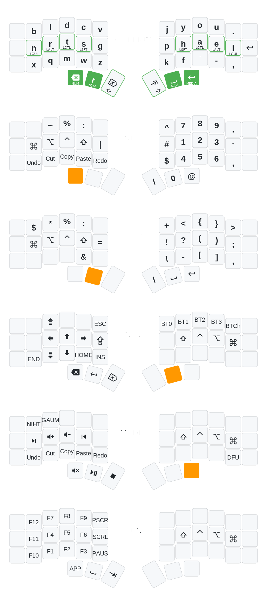

# Keyboard Configuration

Custom keyboard firmware for split ergonomic keyboards using a unified keymap code generation system.

## Combos

### Bootloader Entry (DFU)
- Left hand: `B` + `Q` + `Z`
- Right hand: `P` + `.` + `'`

### GitHub URL
- Keys: `G` + `O` + `U` + `.`
- Outputs: `https://github.com/daranguiz/keyboard-config?tab=readme-ov-file#readme`

## Keymap Visualizations

### Split Ergonomic Keyboards

#### NIGHT Layout

#### Gallium Layout

### Row-Staggered Keyboards (macOS .keylayout)

#### Nightlight

#### Rain

#### Sturdy

## About

This repository uses a unified YAML configuration to generate keymaps for both QMK and ZMK firmware. All keymaps are defined in `config/keymap.yaml` and automatically generated for each keyboard.

See [CLAUDE.md](CLAUDE.md) for detailed documentation.
